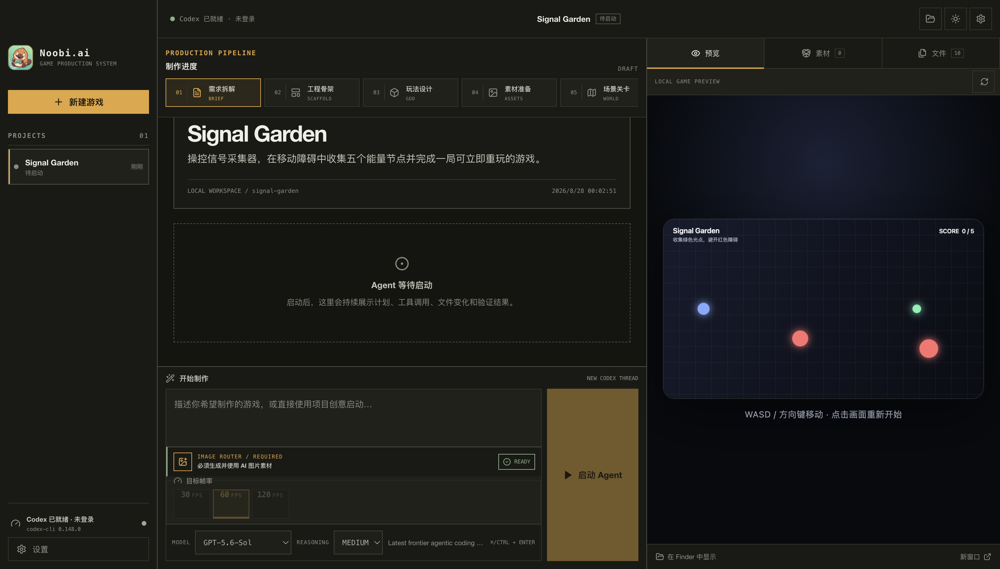
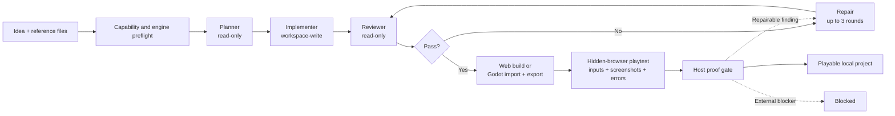
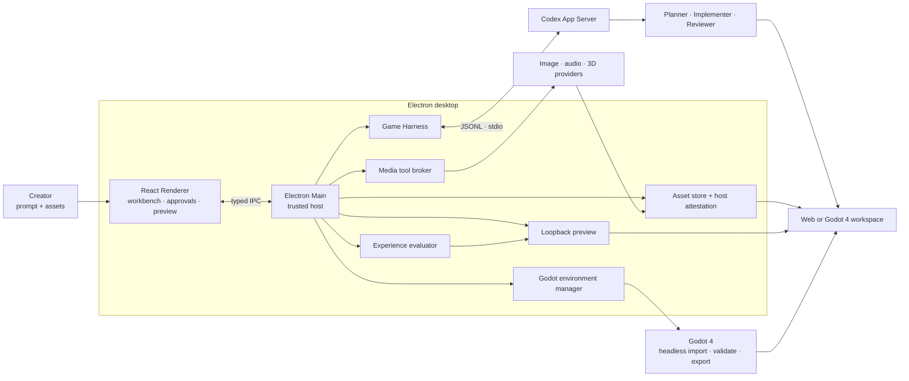

<p align="center">
  
</p>

<h1 align="center">Noobi.ai</h1>

<p align="center">
  <strong>Turn one game idea into a reviewed, playable Web or Godot game.</strong><br>
  A local-first desktop production agent powered by Codex App Server and Godot 4.
</p>

<p align="center">
  <a href="https://github.com/langrenlibai/Noobi.ai/actions/workflows/ci.yml"></a>
  <a href="https://github.com/langrenlibai/Noobi.ai/stargazers"></a>
  <a href="https://github.com/langrenlibai/Noobi.ai/forks"></a>
  
  
</p>

<p align="center">
  <a href="#quick-start"><strong>Run from source</strong></a> ·
  <a href="https://github.com/langrenlibai/Noobi.ai"><strong>GitHub</strong></a> ·
  <a href="#fork-and-customize"><strong>Fork &amp; customize</strong></a> ·
  <a href="docs/ARCHITECTURE.md"><strong>Architecture</strong></a> ·
  <a href="README.zh-CN.md"><strong>简体中文</strong></a>
</p>

<p align="center">
  
</p>

<p align="center"><sub>Describe the world. Noobi.ai turns the brief into a local project you can inspect, play and keep.</sub></p>

<details>
<summary><strong>Explore the README</strong></summary>

<p>
<a href="#why-noobi-ai">Why Noobi.ai</a> ·
<a href="#quick-start">Quick start</a> ·
<a href="#from-idea-to-playable-project">Production loop</a> ·
<a href="#fork-and-customize">Extension points</a> ·
<a href="#current-boundaries">Boundaries</a>
</p>
</details>



Noobi.ai gives Codex a bounded game-production loop instead of asking one agent to improvise everything in a single pass. A read-only Planner scopes the work, an Implementer builds inside an isolated project directory, an independent Reviewer checks the result, and the host builds and plays the production output before completion. Failed review, build or playtest checks return to the same Implementer for up to three repair rounds.

> **Current status:** developer preview for macOS. No signed or notarized binary is published yet; run it from source. The output is a standalone Web or Godot 4 project in your own workspace.

<table>
  <tr>
    <td align="center" width="25%"><strong>01</strong><br><sub>Brief</sub></td>
    <td align="center" width="25%"><strong>02</strong><br><sub>Build</sub></td>
    <td align="center" width="25%"><strong>03</strong><br><sub>Review</sub></td>
    <td align="center" width="25%"><strong>04</strong><br><sub>Play</sub></td>
  </tr>
  <tr>
    <td align="center"><sub>Idea, references and constraints</sub></td>
    <td align="center"><sub>Web or Godot workspace</sub></td>
    <td align="center"><sub>Evidence-based quality gate</sub></td>
    <td align="center"><sub>A project you own</sub></td>
  </tr>
</table>

## Why Noobi.ai

| | What you get |
| --- | --- |
| **From prompt to playable** | Start with a natural-language brief, let the Agent choose Web or Godot 4, and preview a real standalone game workspace locally. |
| **Review-gated production loop** | Planner → Implementer → Reviewer → formal build → automated playtest. Failed checks trigger up to three bounded repair rounds. |
| **Two production modes** | Choose **Prototype** for a fast playable direction or **Delivery** for the stricter media, build and experience gates. |
| **Automatic experience evaluation** | A sandboxed hidden browser exercises core controls, captures evidence, and checks visible gameplay, animation continuity and runtime errors. |
| **Real media pipeline** | Route images, music, speech, sound effects and 3D through configured providers, Codex ImageGen, imported assets or procedural fallbacks. Failed assets remain visible as retryable placeholders. |
| **A workspace you own** | Every game is a normal local project. Inspect the files, continue with Codex, commit it to Git, or take it outside Noobi.ai. |
| **Built to extend** | Add media providers, Codex Skills, MCP servers, agent prompts, project templates, Godot export targets, or an entirely different workbench UI. |

## Quick start

### Requirements

- macOS (the current tested and packaged target)
- Node.js 22 LTS and npm
- a ChatGPT/Codex account
- an available image route: a configured image provider or Codex ImageGen
- Godot 4 with exactly matching Web export templates, only when the Agent selects Godot

```bash
git clone https://github.com/langrenlibai/Noobi.ai.git
cd Noobi.ai
npm ci
npm run dev
```

On first launch, open **Settings → Codex account** and sign in. Noobi.ai uses an app-private `userData/codex-home`; it does not overwrite your global `~/.codex` configuration.

If Codex cannot be located automatically, point Noobi.ai at a binary explicitly:

```bash
NOOBI_CODEX_BIN=/absolute/path/to/codex npm run dev
```

## From idea to playable project



The workbench visualizes `Brief → Scaffold → GDD → Assets → World → Code → Verify → Complete`. Those stages explain progress; the Reviewer and host proof gate decide whether a run is actually complete.


## Fork and customize

Noobi.ai is intentionally organized around replaceable boundaries. A useful fork can start small:

| Goal | Start here |
| --- | --- |
| Add or change a media provider | [`mediaProviderStore.ts`](src/main/mediaProviderStore.ts) and [`mediaGenerationService.ts`](src/main/mediaGenerationService.ts) |
| Connect a tool or internal service through MCP | [`mcpConfigManager.ts`](src/main/mcpConfigManager.ts) |
| Change Planner, Implementer, Reviewer or Repair behavior | [`promptTemplateStore.ts`](src/main/promptTemplateStore.ts) and the prompt contracts in [`gameHarness.ts`](src/main/gameHarness.ts) |
| Change the generated game scaffold and project rules | [`workspaceTemplate.ts`](src/main/workspaceTemplate.ts) |
| Build a new production experience | [`src/renderer/components`](src/renderer/components) |
| Add a new host-side dynamic tool | [`mediaToolBroker.ts`](src/main/mediaToolBroker.ts) |

Good first directions include a new provider adapter, Windows/Linux packaging, sample-game galleries, accessibility improvements, and additional deterministic game templates. See the [roadmap](ROADMAP.md) and [contribution guide](CONTRIBUTING.md).

## What is inside

### Production workbench

- eight visible production stages and a live Agent event stream
- command and file-change approvals
- playable loopback preview, project files, and a unified asset library
- Agent-selected Web or Godot 4 workspace with environment and export-template checks
- host-managed timing and animation contracts without a user-facing FPS strategy selector
- Noobi crew characters, role-based motion, selectable studio scenes and an animated fishing background
- persistent projects and resumable Codex Implementer threads

### Media and extension layer

- configurable image, audio and 3D REST providers
- Codex ImageGen fallback for required image generation
- music, speech, vocal effects, procedural WAV and Web Audio paths
- API-first self-contained GLB generation with a procedural Three.js fallback
- image and file attachments that influence planning, visual direction and asset reuse
- retryable asset work orders that preserve placeholders after generation failures
- native Codex Skills, stdio/HTTP MCP servers, and role-specific prompt customization

### Trust boundaries

- sandboxed Electron Renderer with typed IPC only
- API keys sealed by Electron `safeStorage` and never returned to the Renderer after saving
- localhost-only preview server bound to `127.0.0.1`
- path, symlink, MIME, size, SHA-256 and production-reference validation for generated assets

Read the full [product capability map](docs/PRODUCT_FUNCTIONS.md) and [architecture guide](docs/ARCHITECTURE.md).

## Architecture at a glance



## Development

```bash
npm run typecheck       # renderer + main process
npm test                # unit and integration tests
npm run build           # production renderer and main bundles
npm run verify          # typecheck + tests + production build
npm run smoke:ui        # isolated Electron UI screenshot
```

The following smoke tests use a signed-in Codex account and may consume a small amount of Codex or media-provider quota:

```bash
npm run smoke:codex
npm run smoke:harness
npm run smoke:media
npm run smoke:image
npm run smoke:model3d
npm run smoke:godot
npm run smoke:playtest
```

To produce an unsigned macOS DMG locally:

```bash
npm run package:mac
```

Public distribution still requires Developer ID signing, Apple notarization and stapling.

## Current boundaries

- Web and Godot 4/GDScript workspaces are supported. Godot delivery currently targets a Compatibility-renderer Web export; automatic native macOS, Windows and Linux exports are not connected yet.
- macOS is the current release target. Windows and Linux desktop workflows are on the roadmap.
- Meshy, Tripo and Rodin currently use a synchronous REST gateway contract rather than native asynchronous job orchestration for every vendor.
- The built-in Three.js fallback produces functional low-poly, self-contained GLB assets; it does not claim provider-level high-fidelity organic topology or texturing.
- Quality and completion depend on the selected model, prompt, dependencies and available media routes. A run that cannot satisfy the proof gate remains `blocked` instead of being presented as complete.

## Contributing

Contributions that make the pipeline safer, more portable or easier to extend are welcome. Please read [`CONTRIBUTING.md`](CONTRIBUTING.md), run `npm run verify`, and open a focused pull request. Security reports should follow [`SECURITY.md`](SECURITY.md).

## License

No project license has been published yet. Until the repository owners select and add one, the code remains under the default copyright rules. If you plan to distribute a derivative, watch [the repository issues](https://github.com/langrenlibai/Noobi.ai/issues) or contact the maintainers first.

## Documentation

- [Architecture](docs/ARCHITECTURE.md)
- [Product capabilities](docs/PRODUCT_FUNCTIONS.md)
- [Codex source-reading notes](docs/CODEX_SOURCE_NOTES.md)
- [Roadmap](ROADMAP.md)
- [Contributing](CONTRIBUTING.md)
- [Security policy](SECURITY.md)
