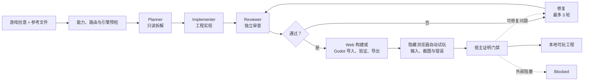

<p align="center">
  
</p>

<h1 align="center">Noobi.ai</h1>

<p align="center">
  <strong>把一句游戏创意，变成经过审查、可以游玩的 Web 或 Godot 游戏。</strong><br>
  基于 Codex App Server 与 Godot 4 的本地优先桌面游戏制作 Agent。
</p>

<p align="center">
  <a href="https://github.com/langrenlibai/Noobi.ai/actions/workflows/ci.yml"></a>
  <a href="https://github.com/langrenlibai/Noobi.ai/stargazers"></a>
  <a href="https://github.com/langrenlibai/Noobi.ai/forks"></a>
  
  
</p>

<p align="center">
  <a href="#快速开始"><strong>从源码运行</strong></a> ·
  <a href="#fork-并定制"><strong>Fork 并定制</strong></a> ·
  <a href="docs/ARCHITECTURE.md"><strong>架构文档</strong></a> ·
  <a href="README.md"><strong>English</strong></a>
</p>

<p align="center">
  
</p>

<p align="center"><sub>说清楚你想做的世界，Noobi.ai 把它变成一个可以检查、可以游玩、真正归你的本地工程。</sub></p>

<details>
<summary><strong>快速浏览</strong></summary>

<p>
<a href="#为什么选择-noobi-ai">为什么选择</a> ·
<a href="#快速开始">快速开始</a> ·
<a href="#从一句创意到可玩工程">制作循环</a> ·
<a href="#fork-并定制">扩展入口</a> ·
<a href="#当前边界">当前边界</a>
</p>
</details>


Noobi.ai 不让单个 Agent 在一次回合里即兴完成所有工作，而是把 Codex 放进一条有边界的游戏制作循环：只读 Planner 拆解任务，Implementer 在独立工程目录中实现，独立 Reviewer 检查真实结果，宿主再正式构建并自动试玩。审查、构建或体验评测未通过时，会交回同一个 Implementer，最多连续修复三轮。

> **当前状态：** macOS 开发者预览版。项目暂未发布已签名、公证的安装包，请从源码运行。生成结果是你自己工作区里的独立 Web 或 Godot 4 游戏工程。

<table>
  <tr>
    <td align="center" width="25%"><strong>01</strong><br><sub>创意</sub></td>
    <td align="center" width="25%"><strong>02</strong><br><sub>制作</sub></td>
    <td align="center" width="25%"><strong>03</strong><br><sub>审查</sub></td>
    <td align="center" width="25%"><strong>04</strong><br><sub>试玩</sub></td>
  </tr>
  <tr>
    <td align="center"><sub>创意、参考文件与约束</sub></td>
    <td align="center"><sub>Web 或 Godot 工程</sub></td>
    <td align="center"><sub>基于证据的质量门禁</sub></td>
    <td align="center"><sub>真正归你的项目</sub></td>
  </tr>
</table>

## 为什么选择 Noobi.ai

| | 你会得到什么 |
| --- | --- |
| **从创意到可玩结果** | 输入自然语言创意，由 Agent 判断使用 Web 或 Godot 4，产出真实游戏工程并在应用内本地预览。 |
| **经过审查的制作循环** | Planner → Implementer → Reviewer → 正式构建 → 自动试玩；失败后最多进行三轮有界修复。 |
| **双生产模式** | **快速原型**用于快速验证玩法方向；**交付验证**会启用更严格的媒体、构建与体验门禁。 |
| **自动体验评测** | 隔离的隐藏浏览器会操作主要玩法、记录截图，检查可见画面、动画连续性和运行错误。 |
| **真实多媒体管线** | 图片、音乐、语音、音效和 3D 可走配置的 Provider、Codex ImageGen、导入素材或程序化回退；失败素材仍以可重试占位留在素材页。 |
| **工程归用户所有** | 每个游戏都是普通本地项目，可以检查文件、继续用 Codex 修改、提交 Git，或完全脱离 Noobi.ai 使用。 |
| **为扩展而设计** | 可增加媒体 Provider、Codex Skills、MCP Server、角色提示词、工程模板、Godot 导出目标或全新的工作台 UI。 |

## 快速开始

### 环境要求

- macOS（当前已测试、已配置打包的目标平台）
- Node.js 22 LTS 与 npm
- 可用的 ChatGPT/Codex 账户
- 可用的图片生成路线：已配置图片 Provider 或 Codex ImageGen
- 只有 Agent 判断需要 Godot 时，才要求 Godot 4 与版本精确匹配的 Web Export Templates

```bash
git clone https://github.com/langrenlibai/Noobi.ai.git
cd Noobi.ai
npm ci
npm run dev
```

首次启动后，打开**设置 → Codex 账户**完成登录。Noobi.ai 使用应用私有的 `userData/codex-home`，不会覆盖全局 `~/.codex` 配置。

如果应用无法自动找到 Codex，可显式指定二进制：

```bash
NOOBI_CODEX_BIN=/absolute/path/to/codex npm run dev
```

## 从一句创意到可玩工程



工作台用 `Brief → Scaffold → GDD → Assets → World → Code → Verify → Complete` 展示制作进度；真正的完成条件由 Reviewer 与宿主证明门禁共同决定。


## Fork 并定制

Noobi.ai 把关键能力放在可替换的边界上，一个有价值的 Fork 可以从很小的改动开始：

| 目标 | 从这里开始 |
| --- | --- |
| 增加或修改媒体 Provider | [`mediaProviderStore.ts`](src/main/mediaProviderStore.ts) 与 [`mediaGenerationService.ts`](src/main/mediaGenerationService.ts) |
| 通过 MCP 连接工具或内部服务 | [`mcpConfigManager.ts`](src/main/mcpConfigManager.ts) |
| 修改 Planner、Implementer、Reviewer 或 Repair 行为 | [`promptTemplateStore.ts`](src/main/promptTemplateStore.ts) 与 [`gameHarness.ts`](src/main/gameHarness.ts) 的提示词契约 |
| 修改生成工程的脚手架与规则 | [`workspaceTemplate.ts`](src/main/workspaceTemplate.ts) |
| 构建全新的制作体验 | [`src/renderer/components`](src/renderer/components) |
| 增加宿主侧 Dynamic Tool | [`mediaToolBroker.ts`](src/main/mediaToolBroker.ts) |

适合第一次贡献的方向包括：新增 Provider 适配器、Windows/Linux 打包、示例游戏展廊、无障碍优化和更多确定性游戏模板。详见[路线图](ROADMAP.md)与[贡献指南](CONTRIBUTING.md)。

## 核心能力

### 制作工作台

- 八个可视制作阶段与实时 Agent 事件流
- 命令和文件修改审批
- 本地可玩预览、工程文件树与统一素材库
- Agent 自动选择 Web 或 Godot 4，并检查 Godot 环境与 Export Templates
- 使用宿主管理的内部时序与动画契约，不再让用户选择帧率生成策略
- Noobi 多角色分工、动作状态、可选工坊场景和动态钓鱼背景
- 持久化项目与可恢复的 Codex Implementer 线程

### 媒体与扩展

- 可配置图片、音频与 3D REST Provider
- 必需图片生成的 Codex ImageGen 回退
- 音乐、语音、人声音效、程序化 WAV 与 Web Audio 路线
- 3D API 优先；未配置时自动生成自包含 Three.js GLB
- 上传的图片和文件可影响需求拆解、视觉方向与素材复用
- 失败素材工单保留占位、错误与尝试次数，可单项重新生成
- Codex 原生 Skills、stdio/HTTP MCP Server 与分角色提示词

### 安全边界

- Electron Renderer 开启 sandbox，只通过 typed IPC 与 Main 通信
- API Key 使用 Electron `safeStorage` 加密，保存后不会向 Renderer 回传明文
- 本地预览只绑定 `127.0.0.1`
- 对生成素材重新校验路径、symlink、MIME、大小、SHA-256 与生产代码引用

完整说明见[产品功能拆解](docs/PRODUCT_FUNCTIONS.md)与[架构文档](docs/ARCHITECTURE.md)。

## 开发与验证

```bash
npm run typecheck       # Renderer + Main 类型检查
npm test                # 单元与集成测试
npm run build           # 生产构建
npm run verify          # 类型检查 + 测试 + 生产构建
npm run smoke:ui        # 隔离数据的 Electron UI 截图
```

以下真实 smoke 会使用已登录账户，并可能消耗少量 Codex 或媒体 Provider 额度：

```bash
npm run smoke:codex
npm run smoke:harness
npm run smoke:media
npm run smoke:image
npm run smoke:model3d
npm run smoke:godot
npm run smoke:playtest
```

在本机生成未签名的 macOS DMG：

```bash
npm run package:mac
```

公网分发仍需 Developer ID 签名、Apple notarization 与 staple。

## 当前边界

- 当前支持 Web 与 Godot 4/GDScript 工程。Godot 自动交付目前使用 Compatibility renderer 的 Web 导出，尚未接通原生 macOS、Windows、Linux 可执行包。
- 当前发行目标是 macOS；Windows 与 Linux 桌面工作流在路线图中。
- Meshy、Tripo、Rodin 当前使用同步 REST 网关契约，并非全部厂商异步任务 API 的原生编排。
- 内置 Three.js 回退提供功能性低多边形自包含 GLB，不冒充外部 3D Provider 的高保真有机拓扑与贴图能力。
- 生成质量与完成率取决于模型、提示、依赖和媒体能力；不能通过证明门禁的任务会保持 `blocked`，不会伪装完成。

## 参与贡献

欢迎提升管线安全性、可移植性和可扩展性的贡献。请先阅读 [`CONTRIBUTING.md`](CONTRIBUTING.md)，运行 `npm run verify`，再提交范围清晰的 Pull Request。安全问题请按 [`SECURITY.md`](SECURITY.md) 私下报告。

## 许可证

项目所有者尚未发布许可证。在正式加入 `LICENSE` 前，仓库内容仍受默认版权规则约束。如果你准备分发衍生版本，请关注[仓库 Issues](https://github.com/langrenlibai/Noobi.ai/issues)或先联系维护者。

## 文档

- [架构](docs/ARCHITECTURE.md)
- [产品功能](docs/PRODUCT_FUNCTIONS.md)
- [Codex 源码阅读基线](docs/CODEX_SOURCE_NOTES.md)
- [路线图](ROADMAP.md)
- [贡献指南](CONTRIBUTING.md)
- [安全策略](SECURITY.md)
